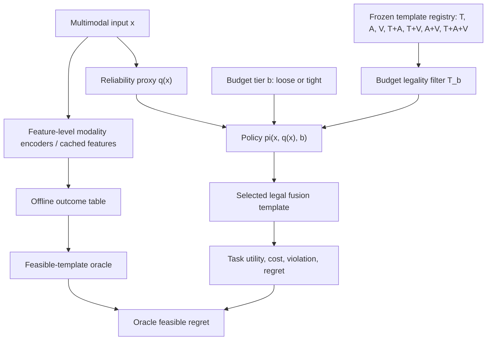

# Handoff: decision-surface-pilot-review

> Generated by LabLock 2026-05-14. Self-contained context for external AI consultation.

## Project background

**Project**: AutoFusion-Bench  
**Domain**: budget-constrained multimodal fusion decision benchmarking  
**Current formalism version**: v1

AutoFusion-Bench is intended as a benchmark-first project, not a new NAS/router method. The core idea is to evaluate multimodal fusion decisions under jointly varying input reliability and inference budget. The intended paper-level claim is that clean-only, robustness-only, or budget-only evaluation can mislead template selection when modality reliability and hard budget constraints change together.

## Current state

**Active experiment**: none yet. The current document is a draft for proposed `exp-001`, shortname `decision-surface-pilot`.  
**Project hypothesis**: Under joint input-reliability shifts and hard inference budgets, static fusion and single-axis adaptive policies systematically diverge from the best feasible fusion-template policy in ranking, feasibility, or template choice.  
**Recent commits**:
- `96f08f2` `[main] LabLock: initialize project`
- `cf6ed12` `Initial commit`

The repo currently has LabLock initialized, but no `scope.lock` experiment has been created yet. The design below is meant to be reviewed before running `lablock exp-init`.

## Architecture (current proposal)

The first experiment is not intended to prove the full benchmark or final paper. It is a protocol-validation pilot: can a small, frozen 2x2 reliability-budget surface produce a measurable decision signal before investing in full MELD + Hateful Memes benchmark execution?

## Proposed experiment

**Target experiment ID**: `exp-001`  
**Shortname**: `decision-surface-pilot`  
**Parent**: none

### Hypothesis

If AutoFusion-Bench's 2x2 reliability-budget surface is meaningful, then a frozen feature-level fusion-template registry will show at least one measurable blind spot of clean-only, reliability-only, or budget-only selection: Kendall tau between clean-loose and degraded-tight template rankings <= 0.3, or oracle feasible regret >= 3 macro-F1 points, within 60 GPU-hours after data preparation on `ntu-gpu43`.

### Primary intervention

Replace a clean-only evaluation surface with a frozen 2x2 reliability-budget decision surface:

- reliability regime: `clean`, `degraded`
- budget tier: `loose`, `tight`
- policy action: choose one legal fusion template from a frozen registry

This is a benchmark-protocol intervention, not a new architecture or training method.

### Planned bundle

- Prepare one fresh tri-modal dataset. Prefer MELD if data acquisition is clean; use MOSEI/MOSI only as a protocol-only fallback.
- Use feature-level evaluation first. Do not claim end-to-end deployment latency from this pilot.
- Freeze a 7-template tri-modal registry: `T`, `A`, `V`, `T+A`, `T+V`, `A+V`, `T+A+V`.
- Profile each template for p50 latency, p95 latency, and peak memory on `ntu-gpu43`.
- Evaluate policy families: `random`, `budget_only`, `reliability_only`, `joint`, and `feasible_oracle`.
- Produce an offline outcome table: 4 condition cells x 7 templates x 3 seeds.

## Constraints

- **Compute**: target <= 60 GPU-hours after data preparation.
- **Calendar time**: target <= 3 days after data preparation.
- **Hardware**: `ntu-gpu43`, direct SSH server, 4 x NVIDIA RTX A5000 with about 24 GB VRAM each.
- **Storage**: use `/usr1/home/s125mdg43_10/projects/AutoFusion-bench` or another `/usr1` path.
- **Execution**: direct SSH + `tmux` or project runner; not Slurm.
- **Claim boundary**: feature-level benchmark only unless encoder-inclusive profiling is explicitly added later.
- **Asset boundary**: do not reuse old `MultiBench`, `AutoFusion_Workspace`, `AutoFusion_Advanced`, `Orthogonal_ELM_Transformers`, or `projects/oelm`; those were deleted as prior-experiment assets.
- **Paper boundary**: this pilot may validate the benchmark signal, but should not be described as the final MELD/Hateful Memes paper package.

## Metrics

Primary:

- `max_oracle_feasible_regret_points`: macro-F1 point gap between the feasible oracle and the best single-axis policy in the degraded-tight cell.

Secondary:

- Kendall tau between clean-loose and degraded-tight template rankings.
- Budget violation rate for `reliability_only` and `joint` policies.
- Rank inversion index across the 4 condition cells.
- Total GPU-hours after dataset preparation.

Statistical handling:

- 3 seeds.
- Report mean +/- std for task utility and decision metrics.

## Predictions

- If H1 is true: degraded-tight ranking diverges from clean-loose ranking with Kendall tau <= 0.3; at least one single-axis policy has oracle feasible regret of 3-6 macro-F1 points; `joint` keeps budget violation <= 1%.
- If H0 is true: clean-loose ranking predicts degraded-tight ranking with Kendall tau >= 0.7; oracle feasible regret stays below 1.5 macro-F1 points; single-axis policies do not show meaningful budget or reliability blind spots.
- Surprising outcome: `T+A+V` remains legal and best under tight budget in all cells, or the reliability proxy makes the joint policy nearly oracle-perfect. Either outcome suggests the surface is too easy or leaky.

## Kill criteria

- Dataset acquisition/preparation blocks for more than 1 calendar day without a confirmed path to MELD or a declared fallback.
- Server setup smoke exceeds 4 GPU-hours or cannot run a single template forward pass.
- Feature extraction or loader shape/split contracts remain unresolved after 12 wall-clock hours.
- Outcome table generation exceeds 60 GPU-hours after dataset preparation.
- Calendar time exceeds 3 days after dataset preparation.
- Tight budget cannot be defined before seeing test outcomes.
- Legality filter allows any selected template with measured cost above the declared budget tier.
- Seed instability exceeds 5 macro-F1 points for most templates and prevents ranking interpretation.

## Success criteria

- Complete 4 x 7 x 3 outcome table.
- Complete measured cost table with p50 latency, p95 latency, and peak memory for every template.
- Support at least one benchmark-signal claim: Kendall tau <= 0.3 between clean-loose and degraded-tight rankings, or oracle feasible regret >= 3 macro-F1 points for a single-axis policy.
- Keep `joint` policy budget violation <= 1% and within 2 macro-F1 points of feasible oracle in degraded-tight.
- Record dataset manifest, split hashes, template registry, budget tier definitions, and server snapshot in the experiment folder.

## Alternatives considered and rejected

- **Full MELD + Hateful Memes package first**: rejected as too expensive before proving the decision surface has any signal.
- **End-to-end encoder-inclusive benchmark first**: rejected for the first pilot because it adds data ingestion and encoder profiling risk; it can be added after the feature-level surface is validated.
- **Reuse old MultiBench/MOSEI server assets**: rejected because the server was cleaned and those assets belonged to prior experiments, not this repo.
- **Use only clean leaderboard accuracy**: rejected because it does not test the central claim about joint reliability-budget stress.
- **Use only budget-aware routing among models**: rejected because AutoFusion-Bench is intended to route among fusion templates / modality-computation plans, not among whole models.

## Specific concern

Please review whether this experiment design is scientifically reasonable before we create `exp-001` and spend compute.

I specifically want feedback on:

1. Is a 2x2 reliability-budget pilot a strong enough first wedge, or is it too synthetic to be informative?
2. Are the success thresholds reasonable: Kendall tau <= 0.3 or oracle feasible regret >= 3 macro-F1 points?
3. Is `max_oracle_feasible_regret_points` the right primary metric, or should rank inversion / budget violation be primary?
4. Is the 7-template registry (`T`, `A`, `V`, `T+A`, `T+V`, `A+V`, `T+A+V`) too simple, or correctly minimal for a first tri-modal pilot?
5. Does the feature-level-first boundary preserve a defensible benchmark claim, or does it weaken the budget argument too much?
6. What leakage risks do you see in reliability proxies, and what minimum leakage check should be required?
7. Should MELD be the first dataset, or should a different tri-modal dataset be used for the first pilot?
8. What would you change before running `lablock exp-init`?

## What I want from you

Give a critical design review. Please lead with blocking concerns, then non-blocking improvements, then a go/no-go recommendation. If you recommend changes, make them concrete enough to update the experiment plan.
